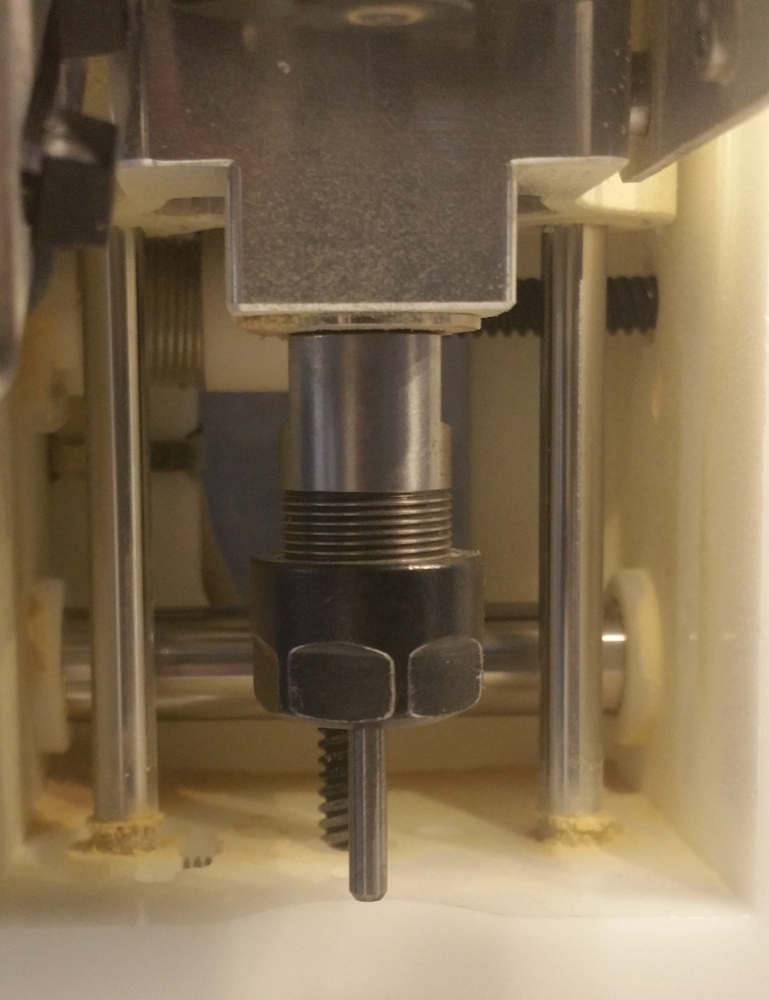
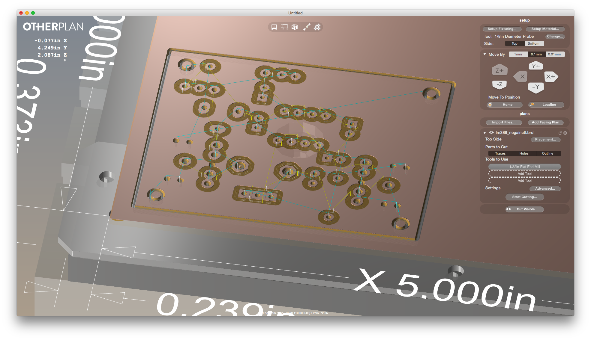
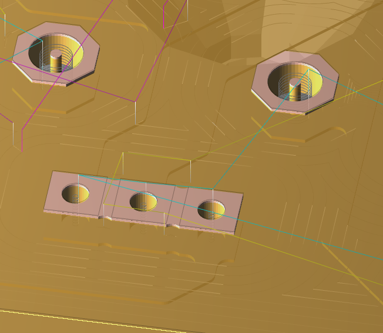
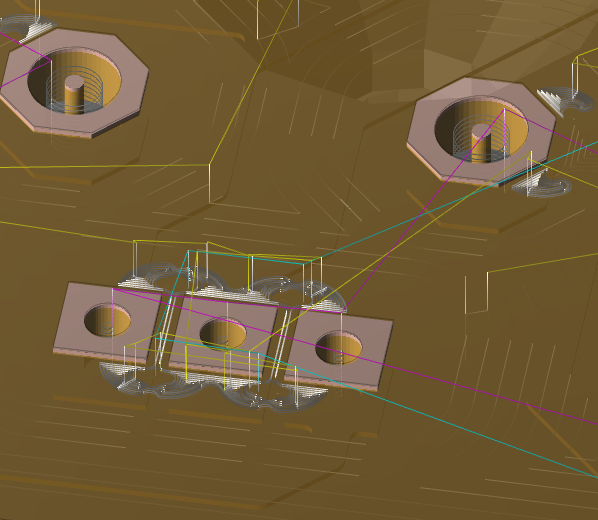

# Producing Double-Sided PCBs on the Othermill (from EAGLE)
Casey Anderson, Winter 2016

## Introduction

This article provides instructions for producing a double-sided `PCB`, designed in EAGLE, on MDP's [Othermill](https://othermachine.co/othermill/features/). The acronym `PCB` stands for `Printed Circuit Board`. Since this is double-sided, we will stick with `Pin Through Hole` (often shortened to `PTH`) components.

## CNC overview

A CNC Machine removes unnecessary parts of a multi-layer material, leaving (in the case of producing circuit boards) conductive `traces` for current to flow and / or `holes` to slide components into.

Material removal is accomplished via a collection of `endmills` (which are similar to drill bits). Larger `endmills` are "faster" or better at easily removing lots of material quickly, whereas smaller `endmills` are "slower" or better at removing material from increasingly tiny areas. Generally one tries to minimize cut time by using the largest `endmills` for as much of the job as possible.

Two wrenches are magnetically attached to the Othermill in order to facilitate switching out `endmills` from the `collet` (the metal cone that holds the `endmills` in place), a normal part of completing different parts of a job.

You can complete most circuit board jobs with the following `endmills`: `1/64"`, `1/32"`, and `1/8"`.

Circuit boards are generally multi-layered. They consist of a synthetic substrate (to mount and hold `traces` and components in place, generally made with a synthetic resin bonded paper) with a layer of Copper (to conduct current) adhered to it. The Othermill can make circuit boards from two types of `blanks`:

* Single Sided: a layer of copper on one side of the substrate.

* Double Sided: consisting of a layer of copper on both sides of the substrate.

The material for a single sided board is referred to as `FR-1`. A double-sided board is typically referred to as `FR-2`. It is important to note that copper oxidizes (rusts) over time so all circuit board blanks must remain in an air-tight container when not in use.

## Powering the Othermill

Once you have logged into the computer make sure that the mill is connected via USB and that it's power switch (on the back panel) is in the `on` position. The light inside of the mill will turn on when the machine is on.

## Open Otherplan

Launch Otherplan (the software that talks to the mill). If the mill is connected and on, you should see a warning at the bottom of the window suggesting that you `Home the Machine`. Click `Start Homing` and wait until it finishes resetting each motor to its default position.

## Setup Fixturing

There are two fixtures typically used with the mill: the aluminum `spoil board` and the `bracket`. We never remove the `spoil board` and prefer to keep the `bracket` attached at all times. The `bracket` is intended to make alignment easier when cutting on both sides of the same object (example: double sided circuit board). Do not remove it unless you have a reason to.

1. Click on `Setup Fixturing` in the setup menu. You will see a new window appear at the bottom of the UI wherein you can either configure the `spoil board` or the `bracket`. Make sure `Bracket` is selected and then click `Locate`.

2. The `spoil board` will move to the inside edge of the front panel of the machine. Before doing anything else, make sure there isn't any leftover debris on the `spoil board`. If you see any leftover strips of tape, or small bits of metal, use the vacuum cleaner and/or a scraper to clear away all unwanted material. When you are sure that the spoil board is clear click `continue` in the window at the bottom of the Otherplan UI.

3. The mill will prompt you to `Reverse the endmill`. You should only use the `1/16" or 1/8" endmill` for this part, as the others are too delicate to be inserted backwards into the mill (if you unsure which `endmill` is which you can use the Making Lab Calipers to confirm size). Using both of the wrenches, carefully remove whatever `endmill` is already in the `collet`, return it to its clear plastic holder, and locate either the `1/16th or 1/8th endmills`. Once you have located the correct `endmill`, reverse it so the `untapered shaft` is pointing down towards the `spoil board`, slide it some (but not all) of the way into the `collet`, and tighten with the wrenches until snug. Click `Continue` to move to the next step.

4. The mill will return to home.

5. The window at the bottom will instruct you to `Align tool tip to bottom of carriage`. Look at the graphic above the spoil board in the UI and adjust (by clicking either` Z+` or `-Z`) the position of the bottom tip of the `endmill` such that it is anywhere between the edges of the `safe zone`. The bottom-most point of the `endmill` doesn't need to be exactly in the middle, just somewhere within those two lines. When you are done adjusting the height of the `endmill` click continue.

6. Otherplan will prompt you to double check that there is nothing on the `spoil board`. If it is clear, simply click `Locate`. The mill will automatically calculate its height relative to the `spoil board` and then check to make sure the `bracket` is properly attached. Every once in a while the mill throws an error in the midst of the location process because it thinks it has found something conductive that is not the `spoil board`. If this happens, check to make sure there are not any metal filings, or other debris, on the `spoil board` and try to restart the location process. If the error persists I have successfully resolved this by power cycling the mill. When the mill returns to home you are done with this part of the setup process.

## Setup Material (pt. 1)

1. Click `Setup material` in the setup window.

2. A new window should pop up at the bottom wherein you can set the material properties. Choose `Double-Sided` and then click `Continue`.

3. Next simply click `Align to Bracket` and then `Done`.

## Setup Material (pt. 2)

1. Cover one side of the Circuit board evenly with double sided tape. Be careful not to overlap any strips of tape, the board needs to sit as evenly on the `spoil board` as possible.

2. Trim any tape that hangs past the edge. Tape on the edges could also make the board uneven on the `spoil board` surface. I use a hardware store razor blade for this but an Xacto knife would also work.

3. Below the `setup` window you will see another window dedicated to moving things around. Click `Loading` to make the `spoil board` move towards the front panel.

4. Align the bottom left corner of the board into the corner of the `bracket` so that the side and bottom edge are flush. Press firmly with your hands across all parts of the board so that it lays flat and feels firmly attached. It should look like this:

!!!! insert photo of properly aligned board here

## Importing your EAGLE file into Otherplan

 Otherplan, can import `.brd` files directly from EAGLE (hooray, no Gerber file nonsense!).

 1. To import your `.brd` file click `Import Files` in the Otherplan setup window (look for a white heading reading `plans`, its below that) and select your file. If you have done this correctly you should see your PCB design reflected on the material in the UI.

 

## Selecting Mills / Configuring Feeds and Speeds

Below the `plans` window is another window wherein you can configure placement of the board, what parts to cut, etc.. Start at the `Tools to Use` section:

1. When you imported your `.brd` file Otherplan should have automatically added a `1/32" Flat End Mill` to the `Tools to Use` window. There are two other slots for `Tools to Use`. Click and Select both `1/64"` and `1/8"`.

2. Wait for the graphical representation of the `.brd` design to update in the UI to reflect the above configuration settings. The goal here is to clear away all of the unnecessary copper.

3. Click the `Advanced` button under the `Tools to Use` section.

4. In the `Advanced Settings` one can change `trace clearance` and `trace cut depth`. `Trace clearance` refers to the amount of clearance a trace gets (the higher the number the more copper will be removed). We prefer to clear away all of the unnecessary copper but leave the `trace depth` at default (`0.006in`). The thicker the traces are, the less likely they are to `de-laminate` (the technical term for coming loose from the substrate) from the board. In order to get these settings right for your job, some guess-work is involved:

  1. The default setting for `trace clearance` is `0.041 in`. If you run your job with this setting most of the copper on the board will not be removed. You can incrementally increase this setting until the graphical representation of your design in the UI reflects the right amount of copper removed. For example, I prefer to clear away all of the unnecessary copper, so I tend to slowly increase the settings towards `1.0in` (my demo .brd file shows as clear when set to a `trace clearance` of `0.8in`) until the graphical representation reflects a board that only has copper for `traces` and `pads`.

  2. Next move to the `Speeds and feeds for tool` section. Here one needs to increase the settings for speeds and feeds such that we can complete a double-sided board in approximately 2hrs. This is something that is set per `endmill`, so change each tool to the following settings:

### 1/8" flat end mill
* Feed rate: 60 in/min (1500 mm/min)
* Plunge rate: 15 in/min (381 mm/min)
* Spindle speed: 16,500 RPM
* Max pass depth: 0.006" (0.15 mm)

### 1/32" flat end mill
* Feed rate: 60 in/min (1500 mm/min)
* Plunge rate: 15 in/min (381 mm/min)
* Spindle speed: 16,500 RPM
* Max pass depth: 0.006" (0.15 mm)

### 1/64" flat end mill
* Feed rate: 15 in/min (381 mm/min)
* Plunge rate: 15 in/min (381 mm/min)
* Spindle speed: 16,500 RPM
* Max pass depth: 0.002" (0.05mm)

## Flight Check

Before starting your job it is best practice to investigate the board layout as shown in Otherplan for any problems. Your primary concern here is to make sure that no unintended connections are made (frequently referred to as `bridging` traces). For example, in the below photo you will see a zoomed in section of the board wherein the three solder pads of a potentiometer will remain connected, resulting in a  non-functional circuit board (which is particularly painful when you have been waiting for it to finish cutting for two hours):

In this case the material was not cleared away because I had not added the `1/64" endmill` into the `Tools to Use` window. After correcting my omission, the copper between each solder pad on my potentiometer is removed:

This is simply an example of why the flight check is needed, though your experience may vary as dictated by the specifics of your design.

## Parts to Cut

Select `Traces` and `Holes` in the `Parts to Cut` settings. The `Outline` should only be cut on the bottom side of a double sided board (otherwise alignment will be impossible between the two sides), so leave this off for the top side. Incidentally, `Otherplan` does not like it if you try to start the job on the bottom side (no idea why).

## Starting the Job

Finally, click the `Start Cutting ...` to start the job. `Otherplan` will prompt you to change the `endmill` to the smallest size in the `Tools to Use` settings, which should be `1/64"`. Do so using the wrenches at the top of the machine then calibrate the machine for the selected `endmill`. When it is done checking the `z-height` of the newly inserted `endmill` your job will start.

## Changing Endmills

When `Otherplan` is finished using a particular sized `endmill` it will prompt you to switch to increasingly larger tools. We recommend using the vacuum to clean out the machine before changing `endmills`.  Doing so will increase the lifespan of each of the `endmills`. Similarly, when changing `endmills` one should take a moment to make sure that the material on the `spoilboard` has not started to come loose. Firmly applying pressure across its entire surface is sufficient.

## Flipping the Board

1. Remove the `FR2` material from the `spoilboard`.
2. Check to make sure the `spoilboard` is free of leftover debris or bits of tape.
3. Remove, and dispose of, all tape from the uncut side of the `FR2` board.
4. Cover the top side of the board with new double-sided tape (including the part that we just cut).
5. Carefully align the `FR2` material, bottom-side up, into the bottom right corner of the `spoilboard`, making sure to align the material to the bottom and side edge as accurately as possible.
6. Firmly apply pressure across the entire surface of the `FR2` material to ensure that it will not come loose from the `spoilboard`.
7. In the `setup` menu change `Side` to `Bottom`.
8. Make sure that `Traces`, `Holes`, and `Outline` are all selected in `Parts to Cut`.
9. Click `Start Cutting ...`
10. Change `endmills` as instructed by `Otherplan` until the job is complete.

## Cleanup

The campfire rule is in effect here: leave the mill in better condition than you found it. At a minimum this should include:
* vacuuming all debris/metal filings out of the machine
* checking to make sure that there is no leftover bits of tape stuck on the `spoilboard`
* returning all copper materials (`FR1` and `FR2`) to air tight containers or ziplock bags
* returning all `endmills` to their plastic containers (and maintaining the ordered arrangement of said [smallest to biggest])
